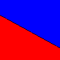

# Imagem Bicolor

Este projeto é uma atividade do curso no Departamento de Matemática da Universidade Federal de Sergipe, sob a supervisão do Prof Evilson Vieira.

## Resultados

### Imagem Bicolor por Produto Interno

<div>
    
</div>

### Imagem Bicolor por Comparação de Coordenadas

<div>
    
</div>

## Compilação e Execução

1. **Compilar**: Utilize o seguinte comando para compilar o código-fonte:

   ```
   gcc ppmreta.c -o ppmreta -lm
   ```

2. **Executar**: Após a compilação, execute o programa com o seguinte comando:

   ```
   ./ppmreta
   ```

3. **Arquivos Gerados**: O programa gerará dois arquivos:

   - `reta-comp.ppm`
   - `reta-cos.ppm`

4. **Visualização dos Arquivos Gerados**: Para visualizar as imagens resultantes, você pode usar o aplicativo `eog` (Eye of GNOME). Utilize os comandos:
   ```
   eog reta-comp.ppm &
   eog reta-cos.ppm &
   ```
